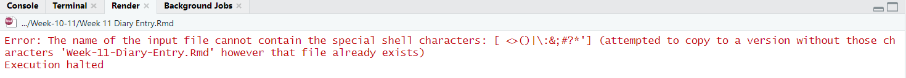
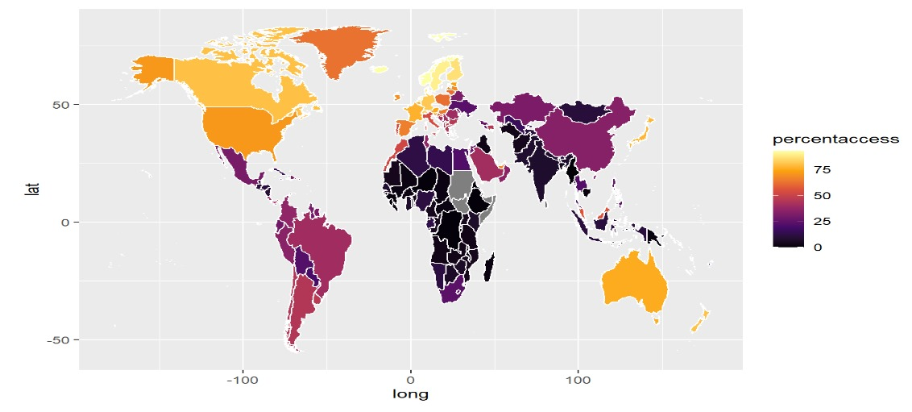

```{r setup, include=FALSE}
knitr::opts_chunk$set(echo = TRUE)
```

## R Markdown
(1) What is the question that you are going to answer? (Answer: One sentence that ends with a question mark that could act like the title of your data story),


How does unequal access to the internet affect socio-economic outcomes?


(2) Why is this an important question? (Answer: 3 sentences, each of which has some evidence, e.g., “According to the United Nations...” to justify why the question you have chosen is important),

According to the world economic forum, "a third of the world’s population (some 2.9 billion people) suffers from the digital divide", and this significant portion of the world hence do not have access to digital tools, technologies, and information that may greatly improve their quality of life and standard of living. The UN also states that "Social well-being will not be possible without a digital transformation", particularly during crisies like COVID-19. Hence, unequal access to the internet excaberates social and economic inequality, and this creates a vicious cycle where countries lack the resources to build public ICT infrastructure, reducing people's ability to utilize digital resources to increase their material/non-material standard of living, hence GDP per capita falls, so these countries become poorer and more unable to implement public ICT infrastructure


Sources:

https://www.weforum.org/agenda/2022/05/how-to-counter-the-global-digital-divide/

https://press.un.org/en/2021/soc4890.doc.htm


(3) Which rows and columns of the dataset will be used to answer this question? (Answer: Actual names of the variables in the dataset that you plan to use).

PLANNING TO INCLUDE:

% population access to the internet, based on country

internet speeds (both broadband and mobile), based on country

cost of internet, based on country

GINI coefficient

GDP per capita

3i survey data

- Being able to use the internet to access information and express opinions should be a human right? 73% agree

- The internet has improved life in my country 66% agree

- Using the internet has helped me pursue my education or that of my household members 67% agree


CONSIDERING, BUT UNLIKELY TO INCLUDE:

ICT development ranking index (only 2017 from what I could find)

DESI index


Include the challenges and errors that you faced and how you overcame them.

One challenge I faced was world maps. I had to try multiple methods, including the sf library (didn't work). Then, geom_polygon() worked, but some countries went missing. It was funny, the map had holes and Russia was gone. This was because the names of the countries used in the dataset did not correspond with the maps library's countries' name (eg USA vs US vs United States etc, Congo Dem. Rep. vs Democratic Republic of Congo). So my solution was to use the ISO codes because they were consistent (still had problems with ISO-2 and ISO-3) but it was resolved; used ISO-3 in the end. Hence, the challenge was overcome using the internet and sleep deprevation. 

(1) List the visualizations that you are going to use in your project (Answer: What are the variables that you are going to plot? How will it answer your larger question?),

Dependent variables will be % population with internet access, internet speed by country, and cost of internet (1GB) by country.
Independent variables will be space, time, GINI, GDP, % population in poverty and possibly other forms of inequality like gender inequality.

World map for dependent variables across space. (completed but have not implemented interactivity)

Scatter plots for independent variables (GINI, GDP, % population in poverty) as compared to dependent variables (completed but needs refinement)

Pie charts for the 3i survey data (completed) and percentage of overall world population with internet access! (uncompleted, will add if I have time)


(2) How do you plan to make it interactive? (Answer: features of ggplot2/shiny/markdown do you plan to use to make the story interactive)

UPDATE: I will display 2 maps of the same dataset type (eg price of the internet over space) of different years that the user can select. Hence the user can compare the scale of inequality across time, which helps prove the point that inequality has been prevalent from the past till now. For example, the 2 selected dates can be 2015 and 2020, which will then be displayed side by side for comparison.

(3) What concepts incorporated in your project were taught in the course and which ones were self-learnt? (Answer: Create a table with topics in one column and Weeks in the other to indicate which concept taught in which week is being used. Leave the entry of the Week column empty for self-learnt concepts)

```{r,eval=TRUE, echo=TRUE}
library(tibble)
concepts <- tibble(
  weekNumber = list(1, 2, 3, 4, 5, 6, 7, "", "", "", "", "", "", ""),
  conceptTaught = c("knitr::include_graphics()", "Manipulation of csv data", "Variable manipulation", "The concept of filtering! Especially for data cleaning & tidying", "Functions, because many of the plotting code is repettitive", "", "The concept of interactive pages and copying code but knowing what to change", "how to plot maps, using library(maps)", "how to plot pie charts", "how to make tables", "In tidyverse, the . refers to the entire object from the lhs of %>% So, it is the data.frame created from the left join of x and y", "gsub('[$,]', '', df$values) #The [] is required for non-alphabets", "library(countrycode): how to 'toggle' between different ISO codes and country names, based on the different naming conventions the different datasets used", "the usage of logarithms to find correlations, and how to use regression lines in general (credits to Bebin :> thank you very much)"
))

knitr::kable(concepts, col.names = gsub("[.]", " ", names(concepts)))
```


Include the challenges and errors that you faced and how you overcame them.
```{r,eval=TRUE, echo=TRUE}


#This keeps happening, despite me not having any files names Week-11-Diary-Entry. I overcame this by just ensuring the name of my Rmd files do not have any spaces in them.



#Evidence for the world map problem
```