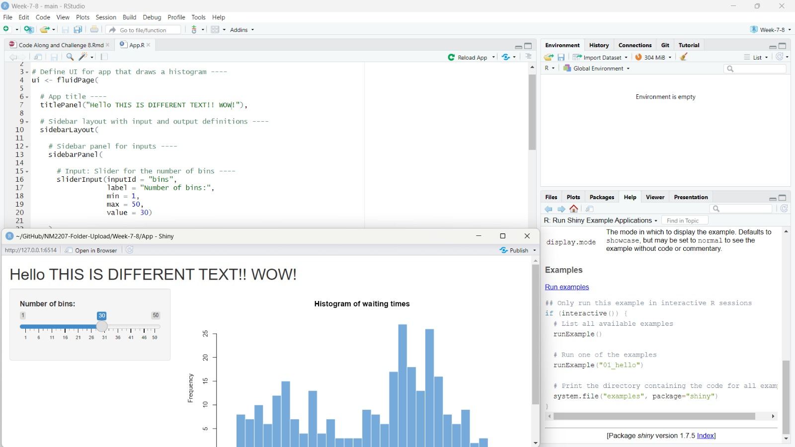
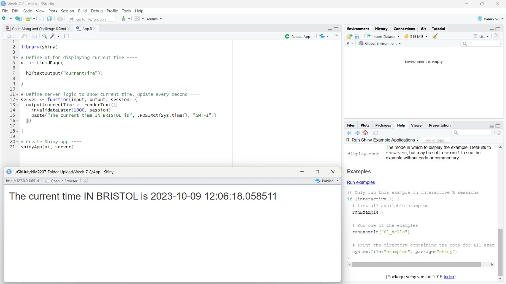

```{r setup, include=FALSE}
knitr::opts_chunk$set(echo = TRUE)
```

```{r, echo=FALSE, fig.cap="code along example for 01_hello", out.width = '80%'}



```

```{r, echo=FALSE, fig.cap="i have a friend studying in bristol hehe", out.width = '100%'}

```


